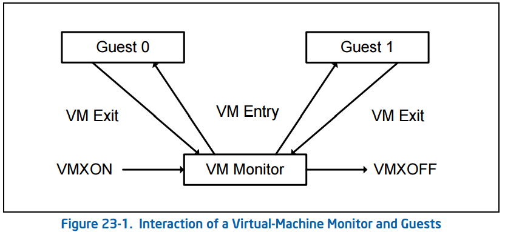

## 第23章 虚拟机扩展介绍

### 23.1 综述

这一章描述了虚拟机架构的基础，综述了虚拟机扩展(VMX)，它支持多软件环境下处理器硬件的虚拟化。

 *** Intel® 64 and IA-32 Architectures Software Developer’s Manual,Volume 2B ***提供了VMX指令的信息。VMX的其他方面和系统编程考量在*** Intel® 64 and IA-32 Architectures Software Developer’s Manual, Volume 3B ***章节中描述。

### 23.2虚拟机架构

虚拟机扩展定义了在IA-32处理器支持虚拟机的处理器标准。支持两类主要的软件：

- 虚拟机监视器(VMM)——VMM扮演着host的角色，对处理器和其他平台软件有着完全的控制。VMM给guest软件呈现虚拟处理器的抽象，并且允许它直接在逻辑处理器上执行。VMM能保留对处理器资源、物理内存、中断管理和I/O的选择性控制。
- Guest软件——每一台虚拟机(VM)是一个guest软件，由一系列操作系统(OS)和应用软院组成。每一个独立运行于其他的虚拟机，并且使用相同的由物理平台提供的处理器、内存、存储器、显卡和I/O接口。guest软件就好像运行在没有VMM的平台一样。为了使VMM保留对平台资源的控制，执行在虚拟机上的软件必须削减特权。

### 23.3 对VMX操作的介绍

VMX操作指处理器以处理器操作形式提供的支持虚拟化的操作。有两种类型的VMX操作：VMX根操作和VMX非根操作。一般来说，VMM运行在VMX根操作，guest软件运行在VMX非根操作。VMX根操作与VMX非根操作的转场叫做VMX转场。有两种类型的VMX转场。进入VMX非根操作叫做VM Entry。从VMX非根操作到VMX根操作叫做VMX Exit。

处理器在VMX根操作有更多的行为。主要的区别是VMX操作有一系列新的指令(VMX指令)，而且某些受限的值可以加载到某种控制寄存器。

处理器在VMX非根操作的行为是受限制的，修改成易虚拟化的。不同于一般的操作，某些指令(包括新的VMCALL指令)和事件会导致VM退出到VMM。因为VM Exit取代普通行为,在VMX非根操作下软件的功能是受限制的。正是这种限制使得VMM保留了对处理器资源的控制。

因为VMX操作限制了软件，即使它运行在当前特权水平(CPL)，guest软件可以运行在最初设计它的特权水平。这种能力也许能简化VMM的开发。

### VMM软件的生命周期

23.1节陈述了VMM和guest软件的生命周期，也陈述了它们之间的交互。下面总结一下生命周期：

- 软件执行`VMXON`指令进入VMX操作
- 使用VM Entry，VMM能使guest进入虚拟机(一次一个)。VMM可以使用`VMLAUNCH`和`VMRESUME`进行VM Entry；使用VM Exit重新获得控制。
- VM Exit转换控制到VMM指定的进入点。由于VM Exit，VMM可以采取合适的操作，使用VM Entry可以返回到虚拟机。
- 最后，VMM也许会关闭它自己并且离开VMX操作。通过执行`VMXOFF`指令可以做到。

### 23.5虚拟机控制结构

控制VMX非根操作和VMX转场的数据结构叫做虚拟机控制结构(VMCS)。通过一个叫做VMCS指针(每个逻辑处理器对应一个)的处理器状态的组件管理访问VMCS。VMCS指针的值是VMCS的64位地址。通过`VMPTRST`和`VMPTRLD`指令对VMCS指针进行读写。VMM通过使用`VMREAD`、`VMWRITE`和`VMCLEAR`配置VMCS。

VMM可以针对它支持的虚拟机使用不同的VMCS。对于有多个逻辑处理器(虚拟处理器)的虚拟户，VMM可以对每个虚拟处理器使用不同的VMCS。

### 23.6 VMX支持发现

在系统软件进入VMX操作之前，必须查找到处理器支持VMX操作。系统软件能通过`CPUID`决定处理器是否支持VMX操作。如果`CPUID.1:ECX.VMX[bit 5] = 1`，说明VMX操作是被支持的。

VMX架构被设计成易扩展的，以至于未来的处理器在VMX操作上能支持其他在第一代VMX架构没有的特性，VMX易扩展的可用性是因为软件使用了VMX能力MSR。

### 23.7 授权和进入VMX操作

在系统软件进入VMX操作之前，需要通过设置`CR4.VMXE[bit 13] = 1`授权。通过执行`VMXON`指令进入VMX操作。如果执行了`CR4.VMXE = 0`，`VMXON`指令会导致非法操作码异常(#UD)。一旦在VMX操作里，不可能清除`CR4.VMXE`。系统软件通过执行`VMXOFF`指令离开VMX操作。在执行完`VMXOFF`之后，`CR4.VMXE`可以在VMX操作之外清除。

`IA32_FEATURE_CONTROL MSR(3AH MSR地址)`也可以控制VMXON。当逻辑处理器被重置，MSR被清除到0。MSR相关位说明如下：

- 0位是锁位。如果这位被清除，VMXON会导致普通保护异常。如果锁位被设置，WRMSR到这个MSR会导致普通保护异常；在达到重置条件之前，MSR不能被修改。系统BIOS可以使用这一位提供一个是否支持VMX的BIOS选项，为了使平台支持VMX，BIOS必须设置1位，2位，或者都有，也可以使用锁位。
- 1位在SMX操作中授权`VMXON`。如果这位被清除，在SMX操作中执行`VMXON`会导致普通保护异常。尝试在不支持VMX操作和SMX操作的逻辑处理器上设置这位会导致普通保护异常。
- 2位在SMX操作外授权`VMXON`。如果这一位被清除了，在SMX操作外执行`VMXON`会导致普通保护异常。尝试在不支持VMX操作的逻辑处理器上设置这位会导致普通保护异常。

>NOTE

在执行`VMXON`之前，软件应该分配自然对齐的4KB内存区域，逻辑处理器可能用于支持VMX操作。这个区域叫做VMXON区域。VMXON的一个操作数提供了VMXON区域的地址(VMXON指针)。

### 23.8 VMX操作的限制

VMX操作规定了在处理器操作的限制，下面是细节：
- 在VMX操作中，处理器在CR0和CR4固定某些特定值，并且不支持其他的值。如果这些位包含任何其他不支持的值，`VMXON`会失败。尝试在VMX操作(包括VMX根操作)期间通过使用`CLTS`，`LMSW`，`MOV CR`指令设置这些位到不支持的值会导致普通保护异常。VM Entry和VM Exit不能设置这些位到不支持的值。软件应该查阅VMX能力MSR ` IA32_VMX_CR0_FIXED0`和`IA32_VMX_CR0_FIXED1`来决定CR0位如何被固定。对于CR4，查阅VMX能力MSR ` IA32_VMX_CR0_FIXED0`和`IA32_VMX_CR0_FIXED1`
- 如果逻辑处理器在A20M模式下，`VMXON`会失败。一旦处理器在VMX操作中，A20M中断会阻塞。所以，在VMX操作中，不可能在A20M模式。
- 逻辑处理器在VMX根操作中，INIT信号会阻塞。在VMX非根操作中不会阻塞。相反的，INIT会导致VM Exit。
- 只有当IA32_VMX_MISC[14]被读到时1的时候，Intel® Processor Trace (Intel PT)才能被用于VMX操作中。在支持Intel PT但是不允许使用VMX操作的处理器中，执行VMXON会清除`IA32_RTIT_CTL.TraceEn`；尝试在VMX操作(包括VMX根操作)使用`WRMSR`指令设置这一位会导致普通包括异常。